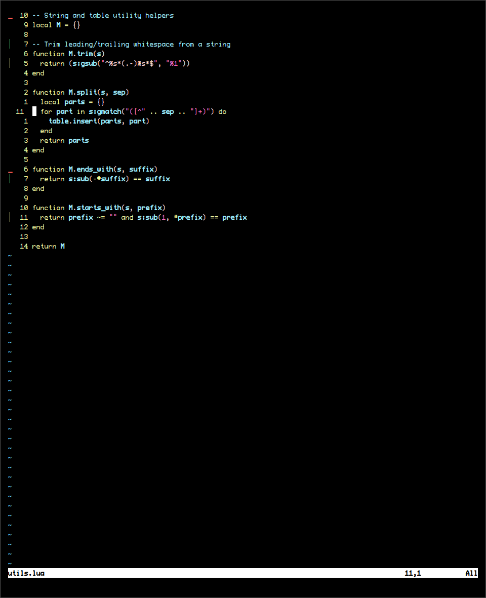
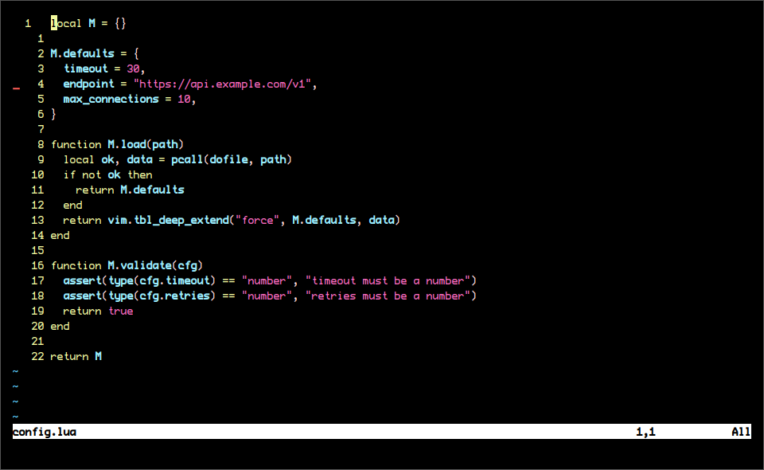
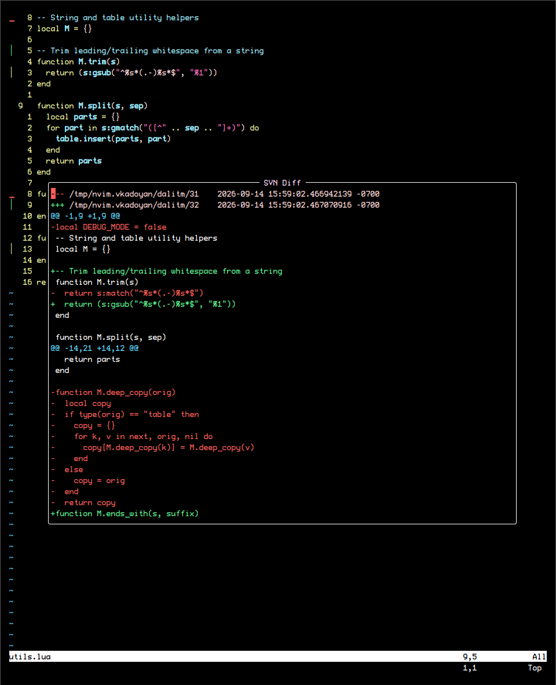
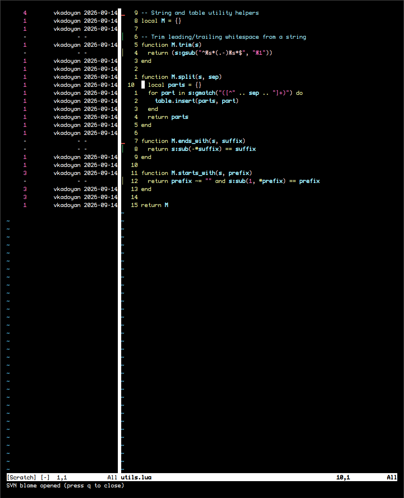
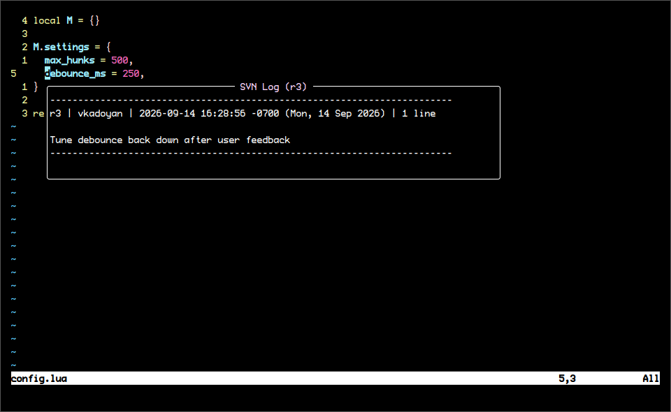
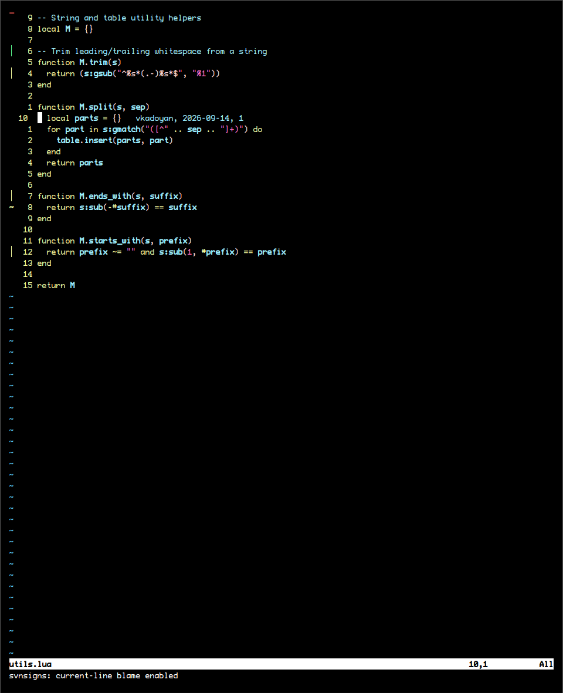

# svnsigns.nvim

Async SVN sign-column, blame, and diff plugin for Neovim — gitsigns-style
integration for SVN working copies.

## Features

- Sign-column markers for added/changed/deleted/topdelete/changedelete lines
  against the SVN base revision, updated asynchronously as you type (no UI
  blocking).
- Current-line blame shown as virtual text, gitsigns-style (opt-in via
  `current_line_blame = true`, or toggle with `:SvnToggleCurrentLineBlame`).
- `:SvnBlame` — inline blame in a synced vertical split.
- `:SvnLog` — SVN log for the revision at the cursor line.
- `:SvnPreview` — floating diff preview of the hunk under the cursor.
- `:SvnResetHunk` / `:SvnRevert` — revert a single hunk or the whole buffer.
- `:SvnFiles` — browse modified SVN files via `fzf-lua`.
- `:SvnBranches` — browse trunk/branches/tags via `fzf-lua` (log preview,
  switch the working copy on selection).
- `:SvnRefresh` — clear svnsigns' internal caches (repo-detection, SVN base
  content) and re-scan the current buffer (useful after `svn update` or
  `svn checkout`-ing a new working copy).

## Screenshots

Sign column showing every hunk type at once (add, change, delete, topdelete,
changedelete):



A pure deletion (`delete`) sign, no replacement lines added:



`:SvnPreview` — floating diff of the hunk under the cursor:



`:SvnBlame` — full-buffer blame in a synced vertical split:



`:SvnLog` — SVN log for the revision history of the line under the cursor:



Current-line blame as virtual text, updating as the cursor moves:



## Requirements

- Neovim 0.10+ (uses `vim.system` for async shell calls)
- `svn` and `diff` available on `$PATH`
- [fzf-lua](https://github.com/ibhagwan/fzf-lua) (optional, only for `:SvnFiles`)

## Installation

With [lazy.nvim](https://github.com/folke/lazy.nvim):

```lua
{
  "vuzhuk/svnsigns.nvim",
  event = { "BufReadPost", "BufNewFile" },
  config = function()
    require("svnsigns").setup({
      signs = {
        add = { text = "│" },
        change = { text = "│" },
        delete = { text = "_" },
        topdelete = { text = "‾" },
        changedelete = { text = "~" },
      },
    })
  end,
}
```

With [packer.nvim](https://github.com/wbthomason/packer.nvim):

```lua
use({
  "vuzhuk/svnsigns.nvim",
  config = function()
    require("svnsigns").setup()
  end,
})
```

With [vim-plug](https://github.com/junegunn/vim-plug):

```vim
Plug 'vuzhuk/svnsigns.nvim'
```

```vim
" after plug#end()
lua require("svnsigns").setup()
```

With [mini.deps](https://github.com/echasnovski/mini.deps):

```lua
MiniDeps.add("vuzhuk/svnsigns.nvim")
require("svnsigns").setup()
```

## Configuration

`setup()` accepts the following options (defaults shown):

```lua
require("svnsigns").setup({
  signs = {
    add = { text = "█" },
    change = { text = "█" },
    delete = { text = "█" },
    topdelete = { text = "█" },
    changedelete = { text = "█" },
  },
  -- Sign priority, passed straight to nvim_buf_set_extmark.
  sign_priority = 6,
  -- Milliseconds to wait after you stop typing before re-diffing the
  -- buffer against the SVN base and updating signs.
  update_debounce = 100,
  -- Show a virtual-text blame annotation on the line the cursor is on.
  -- Off by default; toggle at runtime with :SvnToggleCurrentLineBlame.
  current_line_blame = false,
  -- Formats the current-line blame annotation. Receives a table with
  -- `rev`, `author`, and `date` fields; must return a string.
  current_line_blame_formatter = function(blame)
    return string.format("  %s, %s, %s", blame.author, blame.date, blame.rev)
  end,
})
```

## Highlight Groups

Signs and the current-line blame annotation are colored via these groups,
which you can override in your colorscheme/config:

| Group                      | Default link / color                  |
| --------------------------- | -------------------------------------- |
| `SvnSignsAdd`               | Green, bold                            |
| `SvnSignsChange`            | Yellow, bold                           |
| `SvnSignsDelete`            | Red, bold                              |
| `SvnSignsTopDelete`         | links to `SvnSignsDelete`               |
| `SvnSignsChangeDelete`      | links to `SvnSignsChange`               |
| `SvnSignsCurrentLineBlame`  | links to `Comment`                      |
| `SvnSignsBlameRevision`     | links to `Number` (used in `:SvnBlame`) |
| `SvnSignsBlameAuthor`       | links to `String` (used in `:SvnBlame`) |

```lua
-- Example: override after setup()
vim.api.nvim_set_hl(0, "SvnSignsAdd", { fg = "#a6e3a1" })
```

## Keymaps

This plugin only defines commands — bind them to whatever keys you like, e.g.:

```lua
vim.keymap.set("n", "]s", function() require("svnsigns").next_hunk() end)
vim.keymap.set("n", "[s", function() require("svnsigns").prev_hunk() end)
vim.keymap.set("n", "<leader>sp", function() require("svnsigns").preview_hunk() end)
vim.keymap.set("n", "<leader>sb", function() require("svnsigns").blame_split() end)
vim.keymap.set("n", "<leader>sl", function() require("svnsigns").show_line_log() end)
vim.keymap.set("n", "<leader>sR", function() require("svnsigns").reset_buffer() end)
vim.keymap.set("n", "<leader>sr", function() require("svnsigns").reset_hunk() end)
vim.keymap.set("n", "<leader>fs", function() require("svnsigns").fzf_modified_files() end)
vim.keymap.set("n", "<leader>fb", "<cmd>SvnBranches<cr>")
vim.keymap.set("n", "<leader>tb", "<cmd>SvnToggleCurrentLineBlame<cr>")
```

## Contributing

PRs are welcome. Please branch off `main` (e.g. `feat/short-description`) and
open a pull request rather than pushing directly.
